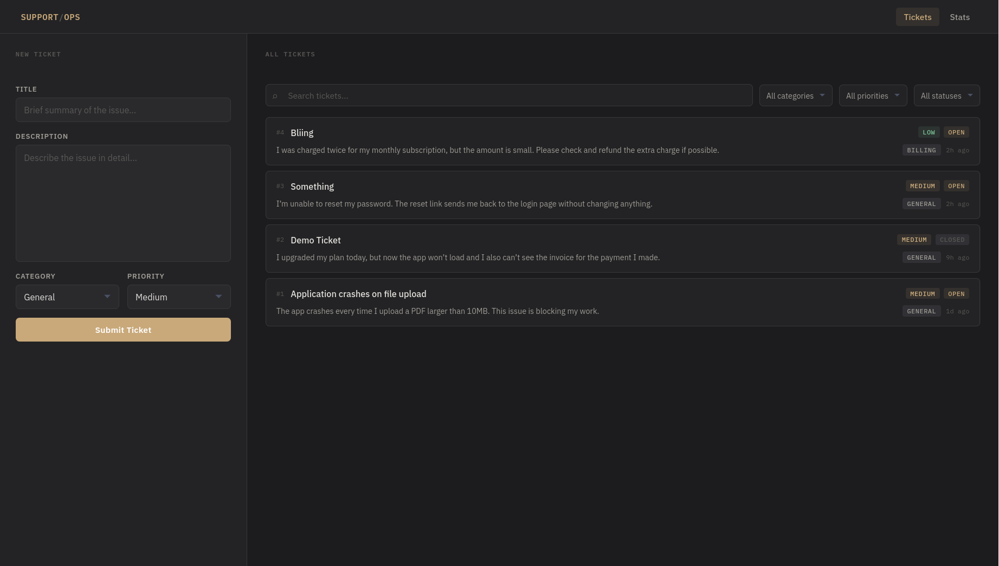

# Support Tickets

A modern support ticket management system where users can submit, browse, filter, and manage support tickets with LLM-assisted auto-classification and prioritization.



## Tech Stack

-   **Frontend**: React with TypeScript, Vite
-   **Backend**: Django REST Framework
-   **Database**: PostgreSQL
-   **LLM Integration**: OpenAI API for auto-classification
-   **Containerization**: Docker & Docker Compose

## Prerequisites

-   Docker and Docker Compose installed on your system
-   OpenAI API key for LLM features

## Setup & Installation

### 1. Clone the Repository

Clone the repository and navigate to the project directory:

```bash
git clone https://github.com/iamnycx/tickets-manager.git
cd support-tickets
```

### 2. Environment Configuration

Create two `.env` files in the project root and backend with the following variables:

```env
LLM_API_KEY=your_openai_api_key_here
```

### 3. Run with Docker Compose

Start all services (database, backend, and frontend):

```bash
docker-compose up --build -d
```

This command will:

-   Build Docker images for frontend and backend
-   Start PostgreSQL database
-   Run Django backend server
-   Run frontend development server

### 4. Access the Application

-   **Frontend**: http://localhost:4173
-   **Backend API**: http://localhost:8000
-   **API Documentation**: http://localhost:8000/api/ (if available)

## Services

### Database (PostgreSQL)

-   Runs on port 5432
-   Data persists in Docker volume `pgdata`

### Backend (Django)

-   Runs on port 8000
-   Automatically runs migrations on startup
-   Includes REST API endpoints for ticket management

### Frontend (React)

-   Runs on port 4173
-   Built with Vite for fast development

## Useful Commands

### View logs

```bash
# All services
docker-compose logs

# Specific service
docker-compose logs backend
docker-compose logs frontend
docker-compose logs db
```

### Stop services

```bash
docker-compose down
```

### Stop services and remove volumes

```bash
docker-compose down -v
```

### Rebuild images

```bash
docker-compose up --build
```

### Access Django shell

```bash
docker-compose exec backend python manage.py shell
```

### Create Django superuser

```bash
docker-compose exec backend python manage.py createsuperuser
```

## Project Structure

```
support-tickets/
├── backend/              # Django REST API
│   ├── config/          # Django settings
│   ├── tickets/         # Tickets app with models and views
│   ├── Dockerfile
│   └── pyproject.toml
├── frontend/            # React + TypeScript
│   ├── src/
│   │   ├── components/  # React components
│   │   └── pages/       # Page components
│   ├── Dockerfile
│   └── package.json
├── docker-compose.yaml  # Orchestration config
└── README.md
```

## API Endpoints

### Tickets

-   `GET /api/tickets/` - List all tickets
-   `POST /api/tickets/` - Create a new ticket
-   `GET /api/tickets/{id}/` - Get ticket details
-   `PATCH /api/tickets/{id}/` - Partial update of ticket
-   `GET /api/tickets/stats/` - Get statistics (total, open count, average per day, priority & category breakdown)
-   `POST /api/tickets/classify/` - LLM-assisted ticket classification (submit description to get suggested category and priority)

## Environment Variables

| Variable            | Description       | Example           |
| ------------------- | ----------------- | ----------------- |
| `POSTGRES_DB`       | Database name     | `tickets`         |
| `POSTGRES_USER`     | Database user     | `postgres`        |
| `POSTGRES_PASSWORD` | Database password | `secure_password` |
| `LLM_API_KEY`       | OpenAI API key    | `sk-...`          |

## Health Checks

All services include health checks:

-   **Database**: pg_isready
-   **Backend**: HTTP requests to `/api/health/`

## Troubleshooting

### Backend container is unhealthy

Check the logs:

```bash
docker-compose logs backend
```

### Port already in use

Change port mappings in `docker-compose.yaml` or kill the process using that port.

### Database connection issues

Ensure the database container is healthy:

```bash
docker-compose logs db
```

## Development

### Frontend

-   Edit files in `frontend/src/`
-   Changes auto-reload due to Vite HMR
-   Run `npm run dev` for local development outside Docker

### Backend

-   Edit files in `backend/`
-   Server auto-reloads with StatReloader
-   Run `python manage.py runserver` for local development

## License

Proprietary - Internal Use Only
